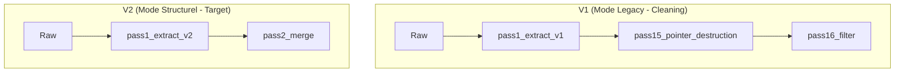

# 📋 Workspace Status — LiturgiCielauri

*Dernière mise à jour : 2026-03-16*

---

## 📋 Pipeline d'Extraction (État : TRANSITION vers V2 - Structurel)

Le pipeline migre d'une approche "Regex-based" (Passe 1 V1) vers une approche **Structurelle Binaire** (Passe 1 V2) pour éliminer les artéfacts à la source.

---

## 📁 Fichiers Canoniques & V2 Tracking

| Script | Rôle | Statut |
|---|---|---|
| `pass1_extract.py` | [V1] Groupement par ID + Heuristiques Labels | 🟡 Legacy |
| `pass1_extract_v2.py`| [V2] Parser binaire structurel (Markers & Longueurs) | 🟢 En cours |
| `pass2_merge.py` | Promotion titres + Liens WT | ✅ OK |

---

## 🔮 Prochaines Étapes (Phase 3 : Structural)

1. **Extraction V2** : Finaliser `pass1_extract_v2.py` pour supprimer `X}ZZXy` sans regex.
2. **Journaling** : Maintenir le journal de bord des tâches pour une traçabilité totale.
3. **Import SurrealDB** : Une fois la pureté structurelle atteinte, procéder à l'import final.

---

## 📒 Journal de Bord (Tasks Journal)
Voir [task_journal.md](task_journal.md) pour le suivi détaillé des sessions.
